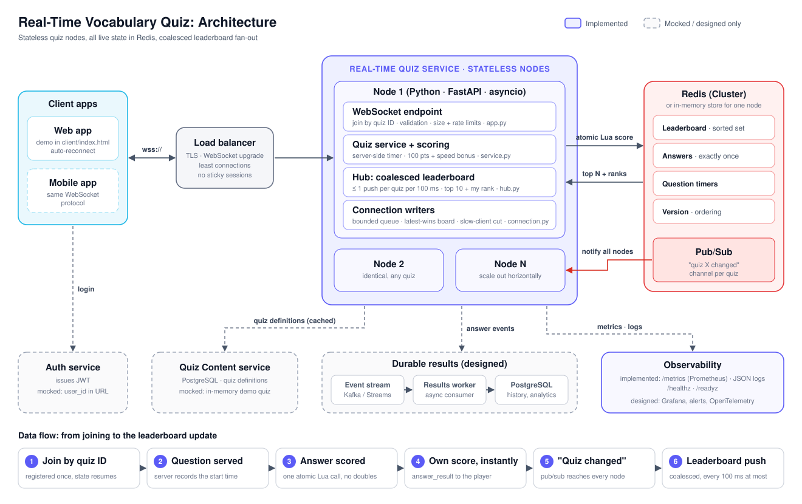

# Real-Time Vocabulary Quiz

A real-time quiz server for an English learning app. Players join a quiz by ID, answer vocabulary questions, get scored by the server, and watch a live leaderboard.



- **System design:** [docs/DESIGN.md](docs/DESIGN.md) covers the architecture diagram, components, data flow, technology choices, scalability, reliability and observability.
- **AI collaboration log:** [docs/AI_COLLABORATION.md](docs/AI_COLLABORATION.md) covers what the AI wrote, how it was prompted, and how each part was verified.
- **Test results:** [docs/TEST_RESULTS.md](docs/TEST_RESULTS.md) holds the raw output of the tests, the mutation check and the load tests, with dates.
- **Requirements traceability:** [docs/REQUIREMENTS.md](docs/REQUIREMENTS.md) maps every requirement in the brief to its code and evidence.

## What is implemented

The **Real-time Quiz Service**: the server that handles connections, scoring and the leaderboard.

| Acceptance criterion | How it is met | Proven by |
|---|---|---|
| Join a quiz by unique ID | `wss://…/ws/quizzes/{quiz_id}`. Unknown IDs close with 4404. `POST /api/quizzes` creates a session with a random ID. | `test_ws.py`: join, unknown quiz, created quiz |
| Many users in one quiz | Per-quiz connection registry. State is in a shared store, so users can even be on different server nodes. | `test_ws.py`: other players; `test_multinode.py` |
| Real-time score updates | The server scores each answer and pushes `answer_result` with the new total immediately. | `test_ws.py`: scoring tests |
| Accurate, consistent scoring | Server-side timer and scoring. One atomic operation performs "dedupe, add points, bump version", so retries and races never double-count. | `test_store_contract.py`: 50 concurrent duplicates count once, on both stores |
| Live leaderboard | Each node pushes the top 10 plus the player's own rank, coalesced to at most one push per quiz every 100 ms. | `test_hub.py`; load test below |

Mocked: authentication, where `user_id` comes from the query string; quiz content, which is an in-memory demo quiz; and the web client, a single HTML page.

## Quick start

Tested with Python 3.14 on macOS. The code uses nothing newer than Python 3.10, and the Dockerfile uses 3.12, but neither older version was tested.

```bash
make install      # creates .venv and installs dependencies
make test         # 50 tests, about 2 s
make mutation     # proves the tests catch 8 deliberate bugs, about 1 min
make run          # http://localhost:8000
make load-test    # in a second terminal while `make run` is running
```

Open http://localhost:8000 in two browser windows, join quiz `DEMO` with different names, and answer questions. Each window's leaderboard updates live.

To run with Redis as the shared store, so several nodes can serve one quiz:

```bash
QUIZ_STORE=redis QUIZ_REDIS_URL=redis://localhost:6379/0 make run
docker compose up --build   # two nodes, nginx and Redis on http://localhost:8080
```

The Docker setup was written but not run, because the authoring machine has no Docker. The multi-node behaviour itself is tested in-process against fakeredis.

## Repository layout

```
quiz_server/
  app.py            WebSocket endpoint, REST, health, metrics
  service.py        join, serve questions, score answers
  scoring.py        pure scoring rule
  hub.py            local connections and coalescing leaderboard broadcaster
  connection.py     per-socket writer, back-pressure, rate limiting
  bus.py            "quiz changed" notifications (local or Redis pub/sub)
  store/            session state: memory.py and redis_store.py (Lua scripts)
  quizzes.py        mocked quiz content
  observability.py  Prometheus metrics, JSON logs
client/index.html   mocked web client
scripts/            load_test.py, mutation_check.py
tests/              unit, contract, end-to-end, multi-node
docs/
  DESIGN.md             system design (Part 1) and AI collaboration in design
  AI_COLLABORATION.md   AI usage, verification and issues found
  TEST_RESULTS.md       measured results, with dates
  REQUIREMENTS.md       requirement-by-requirement checklist
  architecture.svg/.png architecture diagram
deploy/nginx.conf, Dockerfile, docker-compose.yml   multi-node deployment (not run)
Makefile            install, test, mutation, run, load-test, package
```

## Verification

All figures below come from runs on 2026-09-28, except the 4,000-player row, which ran on 2026-09-25. Full output is in [docs/TEST_RESULTS.md](docs/TEST_RESULTS.md).

**Tests.** 50 tests pass. The suite passed 10 runs in a row with no flaky failures. It covers scoring rules, a store contract run against both stores, the end-to-end WebSocket protocol, coalescing and back-pressure, and a two-node deployment sharing one Redis.

**Mutation check.** `scripts/mutation_check.py` breaks eight critical behaviours one at a time and confirms the suite fails for each. All eight are caught. Its first run exposed two weaknesses in the tests themselves, which are now fixed. Details are in the AI collaboration log.

**Load test.** `scripts/load_test.py` simulates players who answer every question and checks correctness at the end. It ran on one uvicorn process with the in-memory store, on an Apple M1 Pro laptop, with the load generator on the same machine.

| Scenario | Answers per second | Answer round trip p50 / p99 | Own answer on leaderboard p50 / p99 | Failed connects | Score mismatches |
|---|---|---|---|---|---|
| 20 quizzes × 50 players | 1,650 | 0.6 / 47 ms | 87 / 164 ms | 0 | 0 |
| 1 quiz × 1,000 players | 917 | 0.6 / 216 ms | 90 / 233 ms | 0 | 0 |
| 20 quizzes × 100 players | 797 | 5.8 / 134 ms | 118 / 307 ms | 0 | 0 |
| 40 quizzes × 100 players (2026-09-25) | 903 | 198 / 659 ms | 403 / 1,036 ms | 31 of 4,000 | 0 |

What the numbers show:

- **Coalescing works.** In the 1,000-player quiz, clients received 21,706 leaderboard messages. Pushing on every answer would have sent 5,000,000.
- **The server's own work is tiny.** Answer processing averaged about 20 microseconds according to the server's histogram. Latency at higher load is queueing for the CPU.
- **About 2,000 active players is where one process saturates on this laptop.** At 4,000, both the server and the load generator ran at roughly one full core each, and latency climbed. Production would run several worker processes per host with the Redis store, which the design supports but which was not load-tested here.
- **Some connections failed at 4,000 players.** 31 of 4,000 TCP connects failed in two of three runs. The likely causes are macOS's listen backlog of 128 and several thousand sockets left in TIME_WAIT by earlier runs. This is not confirmed. Real clients retry with backoff, and the demo client does too.

**Not verified in this environment:**

- The Redis store has run only against fakeredis with real Lua, not a real Redis server.
- The Docker Compose setup has not been run.
- Several failure paths have no automated test: graceful restart, a Redis outage, and pub/sub resync. The full list is in [docs/TEST_RESULTS.md](docs/TEST_RESULTS.md) §6.
- The browser client has only been tested by hand lightly. A two-window test of the first version found and fixed a shared-identity bug. The redesigned page needs the same check.

## Configuration

Environment variables (see `quiz_server/config.py`):

| Variable | Default | Meaning |
|---|---|---|
| `QUIZ_STORE` | `memory` | `memory` or `redis` |
| `QUIZ_REDIS_URL` | `redis://localhost:6379/0` | Redis connection |
| `QUIZ_LEADERBOARD_INTERVAL_S` | `0.1` | Coalescing window |
| `QUIZ_LEADERBOARD_TOP_N` | `10` | Leaderboard size pushed to clients |
| `QUIZ_SEND_QUEUE_SIZE` | `64` | Per-connection queue before a slow client is disconnected |
| `QUIZ_RATE_LIMIT_PER_S` / `QUIZ_RATE_LIMIT_BURST` | `10` / `20` | Per-connection token bucket |
| `QUIZ_MAX_MESSAGE_BYTES` | `4096` | Inbound message cap |
| `QUIZ_SESSION_TTL_S` | `86400` | Expiry of quiz state in Redis |

Endpoints: `/healthz` for liveness, `/readyz` for readiness (checks the store), `/metrics` for Prometheus, and `GET /api/quizzes/{id}/leaderboard` as a REST fallback.

## Packaging the submission

```bash
make clean        # removes caches and build output
make package      # writes dist/realtime-quiz-submission.zip
```

The zip leaves out the virtual environment, caches, `dist/`, `.git/` and the private video notes. After unzipping, run `make install` and then `make test`.

