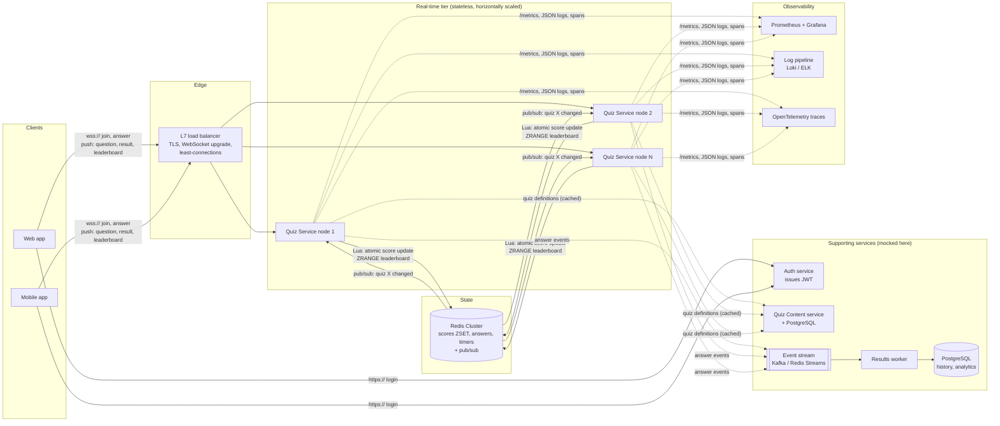
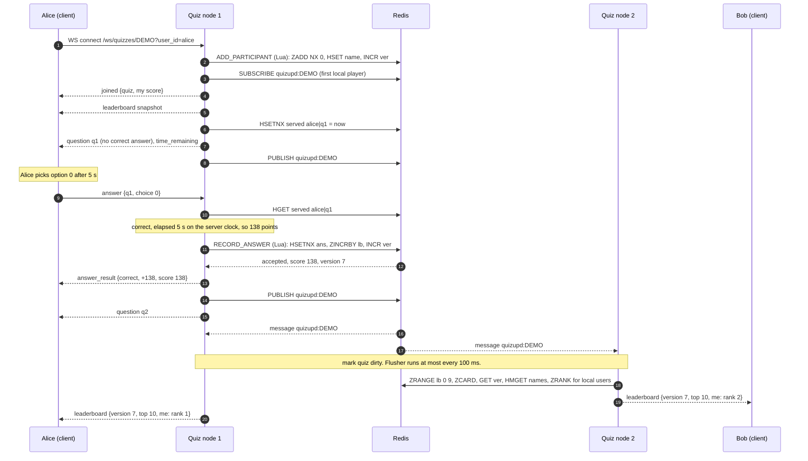

# Real-Time Vocabulary Quiz: System Design

## 1. Scope

The challenge asks for a design of the whole feature and an implementation of one core component.

| Part | Status |
|---|---|
| **Real-time Quiz Service** (connections, scoring, leaderboard) | **Implemented** in `quiz_server/` |
| Session state store (Redis) | Implemented as a pluggable store: in-memory for one node, Redis for many |
| Cross-node fan-out (Redis pub/sub) | Implemented |
| Web client | Minimal mock in `client/index.html` for demos |
| Auth service | Mocked: `user_id` comes from the query string |
| Quiz content service | Mocked: in-memory repository with a demo quiz |
| Durable results store, analytics | Designed only (section 3.7) |

## 2. Architecture

The same diagram as editable Mermaid:

The key property is that **quiz service nodes hold no authoritative state**. Every node can serve any quiz. Any node can die, and its players reconnect to another node and resume exactly where they were.

## 3. Components

### 3.1 Client apps (web, mobile)
- Open one WebSocket per quiz session and render whatever the server pushes.
- Never compute scores. The client sends only "I chose option 2 for question q3".
- Reconnect with exponential backoff and jitter, so a node restart does not cause a thundering herd.
- Ignore any leaderboard snapshot with a `version` lower than the last one rendered.

### 3.2 Load balancer
- Terminates TLS and upgrades HTTP to WebSocket.
- Uses least-connections balancing. Sticky sessions are **not** required because nodes are stateless.
- Health checks hit `/readyz`, which fails when the node cannot reach Redis, so traffic drains away from a broken node.

### 3.3 Real-time Quiz Service (implemented)
One process per node, built with Python asyncio (FastAPI and uvicorn). Internal modules:

| Module | Responsibility |
|---|---|
| `app.py` | WebSocket endpoint, input validation, size and rate limits, REST, health, metrics |
| `service.py` | Join, serve next question, score answers. Server-authoritative. |
| `scoring.py` | Pure scoring function: 100 points for a correct answer plus up to 50 speed bonus, 0 when late |
| `hub.py` | Registry of local connections per quiz, plus the **coalescing leaderboard broadcaster** |
| `connection.py` | Per-socket writer task, bounded queue, "latest wins" leaderboard slot, token-bucket rate limiter |
| `bus.py` | "Quiz X changed" notifications: in-process, or Redis pub/sub across nodes |
| `store/` | Session state behind one interface: `InMemoryStore` and `RedisStore` |
| `observability.py` | Prometheus metrics and JSON logs |
| `protocol.py` | Typed inbound messages (Pydantic), error codes, name clean-up |
| `quizzes.py` | Mocked quiz content repository with the demo quiz |
| `config.py` | All settings, read from environment variables |

### 3.4 Session state store (Redis)
Holds all live quiz state. All keys of one quiz share a `{quiz_id}` hash tag, so in Redis Cluster a quiz lives on one shard and Lua scripts stay single-shard.

| Key | Type | Purpose |
|---|---|---|
| `quiz:{id}:lb` | ZSET | Leaderboard. Score stored negated so ties sort by `user_id`. |
| `quiz:{id}:ans:{user}` | HASH | Points per answered question. `HSETNX` gives exactly-once answers. |
| `quiz:{id}:served` | HASH | First time each question was sent to each user. Server-side timer. |
| `quiz:{id}:names` | HASH | Display names |
| `quiz:{id}:ver` | STRING | Version, bumped on every change. Used for ordering and change detection. |

Every key has a TTL (24 hours by default), so abandoned sessions clean themselves up.

### 3.5 Update bus (Redis pub/sub)
Carries only the message "quiz X changed", never scores. A node subscribes to a quiz's channel only while it has local players in that quiz. A lost message is harmless: the next change, or the 5-second resync, brings everyone up to date from the store.

### 3.6 Auth service (mocked)
In production the client logs in and gets a short-lived JWT. It passes the token on the WebSocket handshake, and the quiz service verifies the signature locally with no network call. The verified `sub` claim becomes `user_id`. The mock accepts `user_id` from the query string instead.

### 3.7 Quiz content, results and analytics (designed, not built)
- **Quiz Content service** with PostgreSQL stores quizzes and questions. Quiz nodes cache definitions in memory because they are immutable once a session starts.
- **Answer events** are appended to a stream (Kafka, or Redis Streams to start) after each accepted answer. A **results worker** writes them to PostgreSQL for history, progress tracking and analytics. This keeps durable writes off the real-time path.

## 4. Data flow

Step by step:

1. **Join.** The client opens a WebSocket with the quiz ID. The node validates the ID, registers the player atomically (idempotent, so rejoining is safe), and sends the current state, a leaderboard snapshot and the next unanswered question.
2. **Question timer.** When a question is first served, the node records the server timestamp with `HSETNX`. Reconnecting cannot reset it. Players cannot answer a question before it is served.
3. **Answer.** The node checks the question and choice, computes elapsed time from the stored timestamp, and computes the points. One Lua script then performs the dedupe check, the score increment and the version bump atomically. A duplicate or retried submission is rejected and never double-counted.
4. **Own score, immediately.** The answering player gets `answer_result` with their new total right away, without waiting for the leaderboard cycle.
5. **Fan-out.** The node publishes "quiz changed". Every node with players in that quiz marks it dirty.
6. **Leaderboard.** Each node's flusher reads the top N and its local players' ranks from Redis once per interval and pushes one snapshot to each local player. Many answers inside one 100 ms window collapse into a single push.

## 5. WebSocket protocol

Endpoint: `GET /ws/quizzes/{quiz_id}?user_id=...&name=...`

| Direction | Type | Payload |
|---|---|---|
| C→S | `answer` | `question_id`, `choice` (int, or null to skip), optional `request_id` |
| C→S | `ping` | |
| S→C | `joined` | `quiz {id,title,question_count}`, `me {user_id,name,score,answered}`, `rejoined` |
| S→C | `question` | `index`, `total`, `question {id,prompt,options,time_limit_s}`, `time_remaining_s` |
| S→C | `answer_result` | `question_id`, `correct`, `correct_index`, `points_awarded`, `score`, `elapsed_s`, `version`, `request_id` |
| S→C | `leaderboard` | `version`, `total_participants`, `top [{rank,user_id,name,score}]`, `me {rank,score}` |
| S→C | `quiz_complete` | |
| S→C | `error` | `code`, `message`. Codes: `bad_request`, `quiz_not_found`, `unknown_question`, `question_not_served`, `invalid_choice`, `already_answered`, `rate_limited`, `internal_error` |

| Close code | Meaning | Client action |
|---|---|---|
| 4400 | Invalid `user_id` | Do not retry |
| 4404 | Quiz does not exist | Do not retry |
| 1009 | Message too large | Fix client |
| 1012 | Server restarting | Reconnect with backoff |
| 1013 | Client too slow to keep up | Reconnect with backoff |

## 6. Technologies and justification

| Component | Choice | Why | Alternatives considered |
|---|---|---|---|
| Transport | WebSocket | Full duplex, low overhead per message, supported by every browser and mobile platform | SSE plus POST (one-way, needs two channels). Socket.IO (fallbacks not needed today, adds protocol lock-in). |
| Quiz service | Python 3.12+, asyncio, FastAPI, uvicorn (uvloop) | One event loop per process holds thousands of idle sockets cheaply. FastAPI adds typed validation with Pydantic. Fast to write and review. | Go or Elixir/Phoenix would give more connections per core. Worth it past roughly 100k concurrent players per region. Node.js with `ws` is equivalent. |
| Message validation | Pydantic v2 discriminated unions | Rejects malformed input at the edge with precise errors | Hand-written checks |
| Live state and leaderboard | Redis (Cluster in production) | Sorted sets give O(log N) rank updates and top-N reads. Lua gives atomic multi-key updates. Sub-millisecond latency. | PostgreSQL (too slow for per-answer ranking at scale), DynamoDB (no native ranking) |
| Cross-node fan-out | Redis pub/sub | Already deployed, sub-millisecond, and the payload is a tiny "changed" signal | Kafka or NATS (more moving parts, better if the bus must also be durable) |
| Durable results | Event stream into PostgreSQL | Keeps the hot path fast. History and analytics become async consumers. | Writing to SQL inline (adds latency and couples availability) |
| Load balancer | nginx, or a cloud ALB | Native WebSocket upgrade and least-connections | HAProxy, Envoy |
| Metrics | Prometheus and Grafana | Pull model, standard histograms, easy alerting | Datadog, CloudWatch |
| Logs | Structured JSON on stdout | Any log pipeline can ingest it. Fields like `quiz_id` and `user_id` make logs searchable. | Plain text |
| Tracing | OpenTelemetry (planned) | Follows one answer across node, Redis and fan-out | |
| Tests | pytest, fakeredis with Lua, Starlette test client | One contract suite runs against both stores. A two-node test runs without Docker. | testcontainers with real Redis (preferable in CI) |

## 7. Scalability

**How it scales out.** Nodes are stateless, so capacity grows by adding nodes behind the load balancer. Redis Cluster shards by quiz via the `{quiz_id}` hash tag, so different quizzes spread across shards and no quiz ever needs cross-shard work.

**Fan-out cost is bounded.** Each node pushes at most one leaderboard per quiz per 100 ms, whatever the answer rate. For a quiz with N players, a naive "push on every answer" design costs O(N) messages per answer, which is O(N²) when everyone answers. Coalescing makes it O(N) per interval. The load test shows the difference.

**Pub/sub traffic follows players.** A node subscribes only to quizzes it has players in, so adding quizzes does not increase load on unrelated nodes.

**Trade-offs made:**

- **Freshness versus cost.** The leaderboard can lag by up to one interval (100 ms by default). This is imperceptible to people, and the answering player sees their own score immediately. The interval is configurable per deployment.
- **Top N plus "my rank" instead of the full board.** Payloads stay small and constant-size. Clients that need the full list can page through the REST endpoint.
- **Per-player rank lookups.** Each flush does one `ZRANK` per local player in the quiz. That is cheap for classroom-sized quizzes, but for a quiz with 50k players on one node it becomes the dominant Redis cost. The planned fix: above a size threshold, update "my rank" every second instead of every 100 ms, or read the whole sorted set once per flush and compute ranks locally.
- **Ordinal ranks with a deterministic tie-break.** Ties are broken by `user_id`, so every node renders the same order. An alternative is to tie-break by who reached the score first. That needs a composite score, and float precision limits it, so it was left out.
- **Redis as the source of truth for live state.** Redis persistence (AOF every second) can lose about one second of answers if the primary crashes before replication. The event stream to PostgreSQL is the durable record. For a practice quiz this trade is acceptable. A graded exam would need synchronous replication (`WAIT`) or a stronger store.
- **One hot quiz is bound by one shard.** A single Redis shard handles on the order of 100k simple operations per second, which is far beyond any realistic single quiz. If it were ever exceeded, the fix is to aggregate scores per node and merge them periodically.

## 8. Performance

- **Nothing blocks the event loop.** All I/O is async. Scoring is pure CPU work measured in microseconds.
- **One Redis round trip for the critical write.** The answer path is one read of the served time plus one Lua script.
- **Serialise once, send to many.** The shared part of a leaderboard is encoded to JSON once per flush. Only each player's small `me` block is added per connection.
- **Pipelined reads.** Rank lookups for all local players are one pipeline, not one round trip each.
- **Slow clients cannot slow others.** Each connection has its own writer task. Leaderboards use a "latest wins" slot, so a slow client skips stale snapshots instead of building a backlog. A client whose queue overflows is disconnected with code 1013, so memory stays bounded.
- **Cached ordering in the in-memory store.** The sort is computed once per change, not once per read.

Measured numbers are in the README.

## 9. Reliability

| Failure | Behaviour | Automated test |
|---|---|---|
| Client network drop | Client reconnects with backoff. Score, answered questions and the running question timer all resume from the store. | ✅ `test_reconnect_resumes_score_and_keeps_question_timer`. Client back-off untested. |
| Duplicate or retried answer | Atomic `HSETNX` rejects it with `already_answered` and returns the current score. Never double-counted. | ✅ contract and WebSocket tests |
| Node crash or deploy | Graceful shutdown sends close code 1012. Clients reconnect to another node with no state lost. | ❌ not tested |
| Slow or stuck client | Bounded queue. Disconnect with 1013 and the client reconnects. Other players are unaffected. | ✅ `test_hub.py` |
| Malformed, oversized or flooding input | Validation error without dropping the socket. Messages over 4 KB close with 1009. A token bucket limits each connection to 10 messages per second with a burst of 20. | ✅ `test_ws.py` |
| Redis unavailable | `/readyz` returns 503 so the load balancer drains the node. Answer attempts return `internal_error`, and retrying is safe because recording is idempotent. | ❌ not tested |
| Lost pub/sub message | Every 5 seconds each node compares versions for its active quizzes and re-pushes any that changed. | ❌ not tested |
| Bus publish fails | The local node still updates its own players. The resync heals the others. | ❌ not tested |
| Clock skew between nodes | Timers use wall-clock time, which is shared across nodes, and nodes run NTP. Skew only shifts the speed bonus. Negative elapsed time is clamped. | ✅ negative elapsed time, in `test_scoring.py` |
| Dead TCP peers | uvicorn WebSocket pings every 20 s close half-open connections. | ❌ uvicorn default, not tested |

Untested rows are also listed in [TEST_RESULTS.md](TEST_RESULTS.md) §6.

## 10. Monitoring and observability

**Metrics** are exposed at `/metrics`.

| Metric | Use it to |
|---|---|
| `quiz_ws_connections` | Plan capacity and balance load across nodes |
| `quiz_answers_total{outcome}` | Track answer throughput. A rise in `duplicate` points to client retry bugs. A rise in `rejected` points to cheating or protocol bugs. |
| `quiz_answer_processing_seconds` | Answer latency SLO, target p99 under 50 ms |
| `quiz_leaderboard_flush_seconds` | Find fan-out cost for large quizzes |
| `quiz_leaderboard_messages_sent_total` | Watch outbound volume |
| `quiz_leaderboard_snapshots_superseded_total` | Spot clients that cannot keep up |
| `quiz_slow_consumer_disconnects_total` | See forced disconnects of slow clients |
| `quiz_joins_total{result}` | Rejoin ratio indicates connection instability |
| `quiz_errors_total{where}` | Store, bus and flush failures |

**Proposed alerts:**
- Answer p99 above 100 ms for 5 minutes.
- `quiz_errors_total` rate above zero for store operations.
- Slow-consumer disconnects above 1% of connections.
- `/readyz` failing on any node.
- Rejoin ratio above 20%, which suggests a network or load balancer problem.

**Logs** are one JSON object per line with `quiz_id`, `user_id`, `question_id` and `version`. Any single answer can be traced through the logs.

**Tracing (next step):** OpenTelemetry spans for `answer` covering the Redis script, the publish and the flush, with the WebSocket message's `request_id` as an attribute. This shows exactly where time goes for a slow answer.

**Dashboards:** connections per node, answers per second, answer latency heatmap, flush duration by quiz size, and Redis CPU and ops per second.

## 11. Maintainability

- **Small modules with one job each.** Transport (`app.py`), quiz rules (`service.py`), scoring (`scoring.py`), fan-out (`hub.py`, `bus.py`) and state (`store/`) are separate. For example, changing the scoring rule touches one pure function and its test file.
- **Swappable backends behind interfaces.** `SessionStore` and `UpdateBus` are abstract classes. The in-memory and Redis versions are chosen at startup, so a new backend, such as DynamoDB or NATS, is a new class, not a rewrite.
- **One contract, two implementations.** The store contract tests run against both stores, so any new store is checked against the same behaviour automatically.
- **Dependency injection for testing.** `create_app()` accepts the store, bus and clock. Tests use a fake clock for exact timing, and fakeredis to run two nodes in one process.
- **Typed, documented protocol.** Pydantic models define every inbound message. The full protocol and its error and close codes are listed in section 5.
- **Configuration in one place.** Every tunable setting is an environment variable in `config.py`, with defaults, and is listed in the README.
- **Comments explain why, not what.** Each module starts with a docstring explaining its purpose, its design choice and how it is verified.
- **One-command workflows.** `make install`, `make test`, `make run` and `make load-test`, plus a mutation check that proves the tests still protect the critical rules.

## 12. Security notes

- The server is authoritative. Correct answers are never sent before a player answers, and the client cannot influence timing.
- In production, identity comes from a verified JWT, never from a query parameter.
- Quiz IDs for new sessions are random 8-character tokens, so they are hard to guess.
- Inputs are length-limited and rate-limited. Display names are normalised and truncated. The demo client renders them with `textContent`, never `innerHTML`.

## 13. Future work

- OpenTelemetry tracing, and a real JWT check.
- The event stream and results worker for durable history.
- Adaptive rank refresh for very large quizzes (section 7).
- Host-controlled "live" mode, where all players see the same question at the same moment, Kahoot-style. The store already supports it: the host would broadcast `question` and set a shared served time.
- Run the contract suite against real Redis in CI with testcontainers.

## 14. AI collaboration in design

The design was produced together with **Claude Code** (Anthropic), an AI coding agent running in VS Code. The full log, including verification, is in [AI_COLLABORATION.md](AI_COLLABORATION.md).

**How the AI was used in the design:**
- The challenge brief was given to the AI as-is. It proposed the architecture, the component split, the WebSocket protocol and the Redis key layout.
- It derived the key design decisions from the acceptance criteria: stateless nodes, server-authoritative scoring, one atomic scoring operation, and coalesced leaderboard pushes.
- It drafted this document, including the diagrams and the trade-offs.

**How the design was checked, not just accepted:**
- **Claims were turned into tests.** The contract suite runs against both stores, and a two-node test covers the shared-state design. A concurrency test covers "no double counting".
- **Claims were measured.** The load test checks the coalescing claim: about 22,000 leaderboard messages instead of 5,000,000 in a 1,000-player quiz. Two runs gave 22,010 and 21,706.
- **The tests themselves were checked.** Deliberately broken versions of the design's key rules were all caught by the tests (see the AI log).
- **Review found design-level mistakes.** For example, a change check that would have read the entire leaderboard from Redis, and a slow-client safeguard that could never trigger on a stuck socket. Both were fixed.
- **Hands-on testing found a bug the automated tests could not.** Playing the demo in two browser windows showed that both windows shared one player identity. The client was fixed.

**What the AI could not decide alone:** which trade-offs are acceptable for the product. Examples are the 100 ms leaderboard delay, possibly losing about one second of answers if Redis fails, and ordinal ranks. These are listed in section 7 so a reviewer can challenge them.

